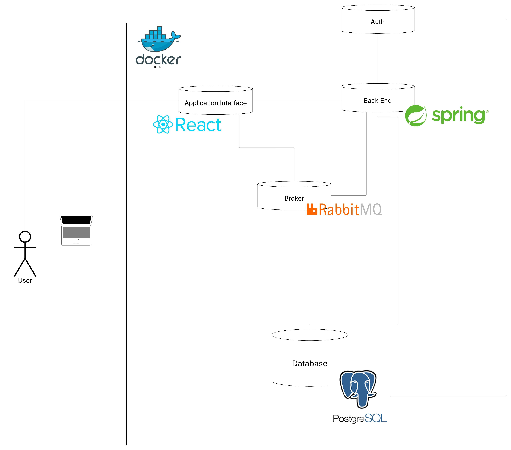
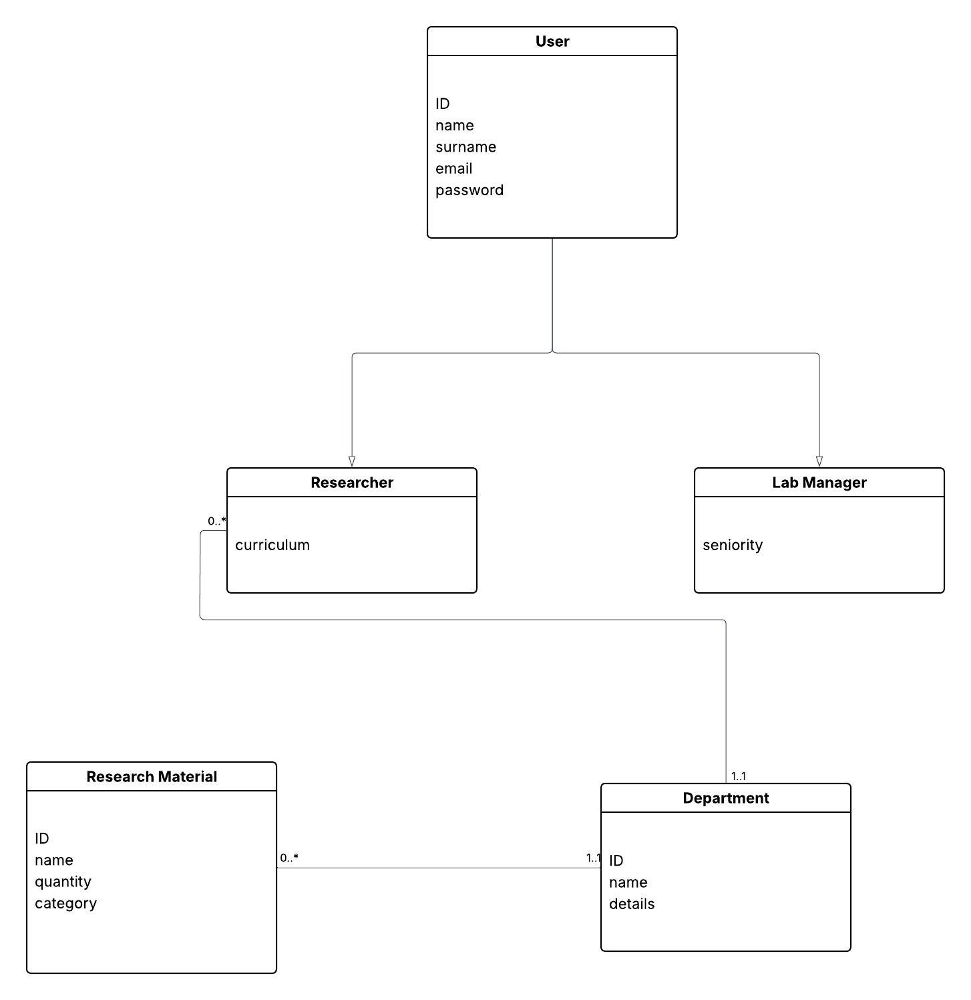

https://github.com/Angelo-Pio/Inventory-Management-System-for-Research-Laboratories-at-Sapienza-University

 The project aims to develop an inventory management system for the research laboratories at Sapienza University of Rome. This system is designed to improve the management and control of resources used in research projects, ensuring greater operational efficiency, reducing waste, and providing continuous support to scientific activities. The primary objective is to create an intuitive and functional tool that allows real-time stock monitoring and simplifies communication among laboratory members.\
\
The platform will be managed by two types of users: the lab manager, who will act as the administrator, and the researchers, who will use the system for operational tasks. The lab manager will be responsible for configuring the system by setting material categories, adding new items, and defining reorder thresholds for each resource. Additionally, they will assign materials to researchers and monitor resource usage through periodic reports. These reports will provide a clear and detailed overview of material consumption, helping to plan procurement and manage budgets more efficiently.\
\
Researchers will use the system to access information about the materials available to them, update stock levels after usage, and report specific needs. For example, if a researcher notices that a material is running low, they can submit a request through the system, which will notify the lab manager. This collaborative approach will enable transparent and effective management, reducing the risk of interruptions due to insufficient stock.\
\
Among the system's primary use cases, the lab manager can configure the platform to meet the laboratory's specific needs by creating material categories and setting stock management rules. Researchers will update the system to reflect material usage during their daily activities, ensuring accurate monitoring. Another significant use case involves researchers submitting requests for unavailable materials or reporting damaged equipment, allowing the lab manager to address the issue promptly.\
\
This system will be a fundamental tool for improving resource management in research laboratories, making operations more organized and ensuring that every laboratory member has access to the information needed to carry out their work efficiently. The platform will also be flexible and adaptable to other contexts or departments in the future, meeting the dynamic needs of scientific\'a0research.\
\

UML
design of the system
software architecture
microservices

TODO:
1 capire le funzionalità del sistema, divisione in microservizi, disegnini (Lofi e omino)
2 user stories e rest requests
3 FP e COCOMO (chat gpt grazie mille)
4 SCRUM PLAN
5 SVILUPPARE

Broker:
reasearcher sends request, admin decides which one to reply

# Technical Schema

https://lucid.app/lucidchart/8b833c1d-6c69-430f-b3aa-390b47346da2/edit?viewport_loc=-11%2C-11%2C1937%2C1123%2C0_0&invitationId=inv_830151d4-5129-4e22-9397-fa24e4f20851}

# Project Requirements

Conducting and presenting the projects

You have to define the requirements by defining the user stories of your entire system. User stories can be documented by using spreadsheets (as the one proposed in a post), and collecting all of them at the end of the project in a booklet. For each user story, it should be provided also a LoFi mockup, to be prepared with the suggested tools (e.g., Balsamiq), and a textual description highlighting specific non functional requirements (if any).
After the definition of the user stories/requirements, you need to estimate the complexity of the software development, time and effort to carry it out, by using Function Points and COCOMO II methods. The analysis should be presented through spreadsheets (see the material) and a booklet explaining and detailing your method. At the end of the academic year, it will be interesting to compare estimation with actual KLOCs of the projects.
After requirements and estimation of the effort, you may design your project and document the software architecture. The development process should be based on SCRUM. It is required that you define the different sprints you may want to adopt for the development, each one with goals and planning. You can document the SCRUM method by adopting specific spreadsheets that have been published.
At the end, all the work done (design of the system, software architecture, sprints with relevant analytics, e.g., burndown charts) should be documented in a booklet.
The system is being developed in whatever technologies/framework you may want. The release should be done by providing the link of a GitHub repo with all the source code, configuration files, any other file you may need (please remember we have adopted a IaC approach - Infrastructure as Code) AND the Dockerfiles, docker-compose files, etc. which will allow the instructors to re-build/re-deploy your system on whatever platform (either on-premise or on cloud).
At the discussion of the project, you may need to take
a laptop with all the system running, to be used for a demo of the project
slides to be used (maximum 15 minutes of talk) for presenting the project idea, development, etc. 
all the booklets produced during the development process
Before the discussion, when booking your discussion, you will be required to provide the items below.

The discussion is booked by sending an email (the exact format of the email will be described in following posts, one for each session) and the instructor will take an appointment with the group for discussing the project. Please remind that all exams are IN-PRESENCE, so all group members will have to attend physically the discussion. Discussions will be held in a room with an HDMI projector, so please take a laptop for presenting your slides and your demo, and the adapter for your specific laptop in order to connect to the HDMI cable. The discussion of the project consists in a short talk with slides (maximum 15 minutes of talk) which presents the project idea, development, etc., and a demo of the system being built (via Docker tools) and running. The overall length of the discussion is approx. 25 minutes for each group.

Submission of the project material

A link to a GitHub repo, containing the following items.

1. The following textual items. All the textual documents must follow the Markdown syntax. Please refer to https://www.markdownguide.org/basic-syntax/ if you are not entirely familiar with it.
Following is the list of textual files to be submitted:
input.txt, which contains the description of the system (the one submitted in the form for approval) and the list of user stories.
Structure of the file: input.txt, cf. https://drive.google.com/file/d/10mAO_d-HR4ubnqR8bcofkAYdddfDJKdu/view?usp=sharing 
An example of input.txt is accessible at https://drive.google.com/file/d/1klvQ8r8WKfW86HS8HQ801QZh-yXZ05sK/view?usp=sharing
Student_doc.md, which contains the specifics of the deployed system.
Structure of the file: Student_doc.md, cf. https://drive.google.com/file/d/1stCQoen6ojT3hBexAkyp0Ja8H6XzOuFn/view?usp=sharing
An example of a Student_doc.md file is accessible at https://drive.google.com/file/d/15lmOqwYTG4qORk3bZgwMlRBWLaA5Gn-I/view?usp=sharing
DataMetrics.json, which contains the features/qualities of the system. The file is created to categorize and group the user stories and analyze the dependencies and constraints they pose to the architectural design of the derived system. In particular, the user stories are grouped based on their real-world scope, i.e., user stories that have the same context and a similar scope are in the same group. Further, the creation of a group is based on the following factors: (a) user stories related to the same real-world object or situation are grouped together, and (b) user stories of different users who perform the same action are grouped together. From an architectural design point of view, all the user stories that belong to the same group have to be fulfilled by the same container. In this way, the system ensures the separation of concerns between containers while maintaining scope-related user stories grouping. How the user stories are fulfilled by the microservices inside the container is a design choice not inspected by this file.
Structure of the file: DataMetrics.json, cf. https://drive.google.com/file/d/1_oJ8PKU7dzI4KA2uGuO-20JnJKX1Vj2A/view?usp=sharing
- set_id: numerical id of the set
- set_name: name of the set
- user_stories: list of ids of the user stories
- links: list of ids of other sets having related context
- db: need to store or retrieve data
From an architectural point of view, user stories that belong to linked sets can be fulfilled by the same container and the sets of user stories that are required to store or retrieve data must be fulfilled by a container hosting a database microservice.
An example of DataMetrics.json file is accessible at https://drive.google.com/file/d/1p4nO8uYVAY9V-_LL5e2XG1_bQT00pRb3/view?usp=sharing.
A sketch like https://drive.google.com/file/d/1oLtqBTFDqOM2x-r8IUq0YrCrt88b5CqK/view?usp=sharing can be helpful in constructing this file.
2. A folder with the following documents/booklets
The estimation of the complexity of the software development, time and effort to carry it out, by using Function Points and COCOMO II methods. The analysis should be presented through spreadsheets and a booklet explaining and detailing your method. 
The development process is based on SCRUM. It is required that you show the different sprints you may want to adopt for the development, each one with goals and planning. You can document the SCRUM method by adopting specific spreadsheets that have been published.
All the work done (design of the system, software architecture, sprints with relevant analytics, e.g., burndown charts) should be documented in a booklet.
3. A folder with the system developed in whatever technologies/framework you may want. In this folder all the source code, configuration files, and any other file you may need (please remember we have adopted an IaC approach - Infrastructure as Code) AND the Dockerfiles, docker-compose files, etc. which will allow the instructors to re-build/re-deploy your system on whatever platform (either on-premise or on cloud).

So, to wrap up, the structure of the repo submitted should be like this one, cf. https://drive.google.com/drive/folders/1HO9h8lQ8udyBhqjNk8BJ8hAODIONItcA?usp=sharing:
.
├── input.txt
├── Student_doc.md
├── DataMetrics.json
├── source    # directory containing the source files of the developed system
└── booklets # directory containing the documents about the development process, estimation, slides to be used for the discussion, etc.

Each group needs to create a repo named <MATRICOLA>_<PROJECT> where <MATRICOLA> is the INFOSTUD Student ID of the group leader and <PROJECT> is the acronym of your project.

In order to avoid misunderstandings, this is repeated.
Before the discussion, you need to share with the instructor all the documents and materials of your project, in particular
The requirements (as user stories) of your entire system. User stories can be documented by using a spreadsheet and collecting all of them in a booklet. For each user story, it should be provided also a LoFi mockup, to be prepared with the suggested tools (e.g., Balsamiq), and a textual description highlighting specific non functional requirements (if any).
The estimation of the complexity of the software development, time and effort to carry it out, by using Function Points and COCOMO II methods. The analysis should be presented through spreadsheets and a booklet explaining and detailing your method. 
The development process based on SCRUM.
It is required that you show the different sprints you may want to adopt for the development, each one with goals and planning. You can document the SCRUM method by adopting specific spreadsheets that have been published.
All the work done (design of the system, software architecture, sprints with relevant analytics, e.g., burndown charts) should be documented in a booklet.
The system developed in whatever technologies/framework you may want. The release should be done by providing the link of a GitHub repo with all the source code, configuration files, any other file you may need (please remember we have adopted a IaC approach - Infrastructure as Code) AND the Dockerfiles, docker-compose files, etc. which will allow the instructors to re-build/re-deploy your system on whatever platform (either on-premise or on cloud).
Specific textual files (input.txt, DataMetrics.json, Student_doc.md)
All the above materials should be provided as a link to a GitHub repo with everything or it, or in any way you may deem appropriate.

# User stories

1. As a lab manager, I want to create and edit material categories so that I can organize inventory items logically and make them easier to manage.

2. As a lab manager, I want to add new materials (with details such as name, category, and stock level) so that all resources used in the lab are tracked in the system.

3. As a lab manager, I want to set reorder thresholds for each material so that I receive alerts when stock levels fall below the defined minimum.

4. As a lab manager, I want to assign specific materials to individual researchers or research groups so that responsibilities and access rights are clearly defined.

5. As a lab manager, I want to view and download periodic reports of material usage so that I can plan procurement and manage the laboratory budget more efficiently.

6. As a lab manager, I want to receive notifications about material requests or reported damaged equipment so that I can take prompt action and avoid disruptions to research activities.

7. As a researcher, I want to view a real-time list of available materials assigned to my department so that I know exactly what resources I can use for my projects.

8. As a researcher, I want to update stock levels after I use materials so that the inventory remains accurate for all laboratory members.

9. As a researcher, I want to submit requests for materials that are low or unavailable so that the lab manager can reorder them in time.

10. As a researcher, I want to report damaged or malfunctioning equipment through the system so that the issue is documented and addressed promptly.

11. As a researcher, I want to track the status of my material requests so that I know when new supplies or replacements will arrive.

12. As a laboratory member, I want the system to provide real-time stock updates so that everyone can make decisions based on accurate, up-to-date information.

13. As a laboratory member, I want the system interface to be intuitive and easy to use so that I can manage my tasks without requiring extensive training.

14. As an administrator, I want the system to be configurable and adaptable to other contexts or departments so that it can be scaled or reused  across the university.

